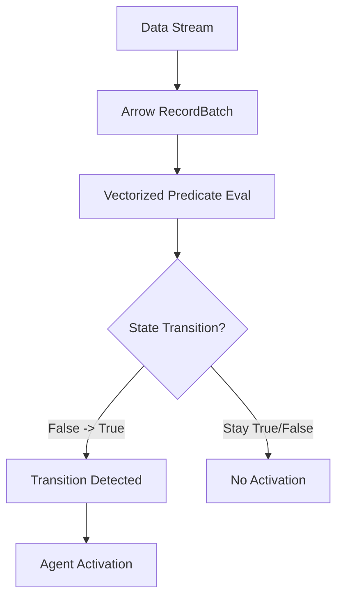

# Arrow Rule Agent

A high-performance, vectorized rule engine in Rust that operates directly on Apache Arrow `RecordBatch`es.

## Features
- **Vectorized Evaluation**: Evaluates predicates over thousands of rows simultaneously using Arrow and DataFusion.
- **Deterministic Activation**: Guarantees rules fire exactly once per batch when a condition transitions from `false` to `true`.
- **Backend Agnostic**: Logical rule IR can be compiled to different physical execution backends (DataFusion by default).
- **Agentic Integration**: Specifically designed to trigger downstream agent activations.

## Core Abstraction

Rules are evaluated per `RecordBatch` ingestion. The engine tracks the state of each rule to detect transitions.



## Setup

```bash
cargo build
cargo run --example demo
```
